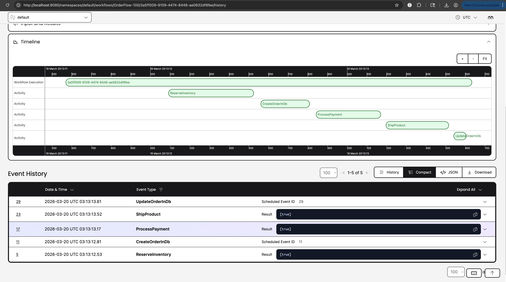
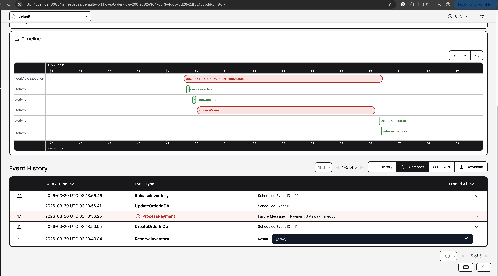
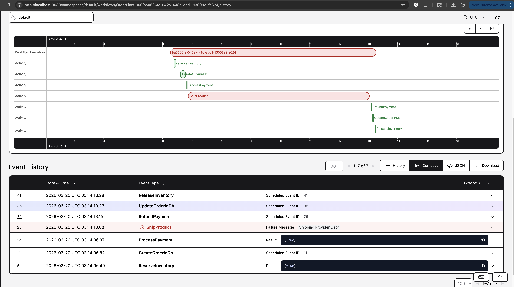

# Temporal Demo: Multi-Service SAGA Orchestration

This project demonstrates distributed SAGA orchestration using [Temporal.io](https://temporal.io) and Spring Boot/Java. It features four self-contained microservices choreographed by a central Temporal orchestrator to maintain data consistency across distributed transactions.

## Architecture


The system transitions an Order through reserving inventory, processing payment, and shipping the product. If any step fails, **Temporal's built-in Saga functionality** will automatically execute rollback activities (e.g., releasing inventory or refunding payment).

*   **Temporal Server & UI**: Core orchestration engine and web dashboard.
*   **Order Service**: Exposes REST APIs, manages local database persistence, and runs the `OrderWorkflow` which acts as the SAGA orchestrator.
*   **Inventory Service**: Mock Temporal worker handling `reserveInventory` and `releaseInventory`.
*   **Payment Service**: Mock Temporal worker handling `processPayment` and `refundPayment`.
*   **Shipping Service**: Mock Temporal worker handling `shipProduct` and `cancelShipping`.

## Setup and Initialization

1.  **Start Docker Desktop**: Ensure your Docker daemon is running.
2.  **Pull Images and Start Containers**: Open your terminal in the root of this project and run:

    ```bash
    docker compose up --build -d
    ```

3.  **Verify Services**:
    *   Temporal UI: [http://localhost:8080](http://localhost:8080)
    *   Order Service APIs: `http://localhost:8081/api/orders`

---

## Testing the SAGA Pattern

We have built specific endpoints and flags to demonstrate Temporal's robust handling of typical microservice failures.

### 1. The Happy Path (Standard Execution)

Create an order that successfully reserves inventory, charges payment, and ships.

```bash
curl -X POST http://localhost:8081/api/orders \
  -H "Content-Type: application/json" \
  -d '{"orderId": "100", "amount": 50.0}'
```

*   **Verification**: Open the Temporal UI ([http://localhost:8080](http://localhost:8080)), locate `OrderFlow-100`, and observe it transition through all 4 activities successfully.


### 2. SAGA Rollback: Payment Failure

Demonstrate a failure in the Payment service. We'll pass `simulatePaymentFailure=true` which forces the payment activity to fail after exhausting its retries (configured for 3 attempts). 

```bash
curl -X POST "http://localhost:8081/api/orders?simulatePaymentFailure=true" \
  -H "Content-Type: application/json" \
  -d '{"orderId": "200", "amount": 75.0}'
```

*   **SAGA Verification**:
    1. Open the Temporal UI and monitor `OrderFlow-200`.
    2. The `reserveInventory` activity will succeed.
    3. The `processPayment` activity will fail multiple times (Pending state).
    4. Once retries are exhausted, the workflow catches the failure, triggers `saga.compensate()`, and executes `releaseInventory` and cancels the order in DB!
    5. Query the workflow status: `curl http://localhost:8081/api/orders/200/workflow-status` (Will return `CANCELED_DUE_TO_FAILURE`).

    

### 3. SAGA Rollback: Shipping Failure

A failure at the end of the line will trigger rollbacks for *both* payment and inventory.

```bash
curl -X POST "http://localhost:8081/api/orders?simulateShippingFailure=true" \
  -H "Content-Type: application/json" \
  -d '{"orderId": "300", "amount": 100.0}'
```

### 4. Manual Restarts and Resetting from the UI

If a service goes down completely and a workflow fails, you can "Reset" it from the Temporal UI, or simply issue a new POST request.

1.  Open the Temporal UI ([http://localhost:8080](http://localhost:8080)).
2.  Go to the **Workflows** list and click on the failed workflow (e.g., `OrderFlow-200`).
3.  Click the **Reset** button in the top right corner (often under an actions dropdown).
4.  Select the **First Workflow Task** to restart the entire workflow execution from the beginning.
5.  Alternatively, because the default `WorkflowIdReusePolicy` allows reusing IDs for failed workflows, you can simply run your `POST /api/orders` curl again using the **exact same `orderId`**. Temporal will start a fresh execution for that failed order!



## Teardown

To shut down the cluster and clean up:
```bash
docker compose down
```
*(Note: Order data is preserved in the Docker volume. Run `docker compose down -v` to wipe it)*
