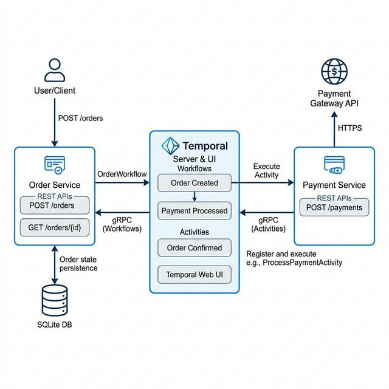

# Temporal Demo: Order Management API (Spring Boot)

This project is a demonstration of microservice orchestration using [Temporal.io](https://temporal.io) and Spring Boot. It features two self-contained microservices (`order-service` and `payment-service`) that use Temporal Workflows and Activities to guarantee execution, handle automatic retries, and recover from failures like database crashes or downstream service outages.

## Architecture



*   **Temporal Server & UI**: Core orchestration engine and its web dashboard.
*   **Order Service**: Exposes REST APIs, manages SQLite persistence using Spring Data JPA, and runs the `OrderWorkflow` orchestrator and `OrderActivity`.
*   **Payment Service**: A headless worker service that executes the remote `PaymentActivity`.

## Prerequisites

*   [Docker Desktop](https://www.docker.com/products/docker-desktop/) (Must be running)
*   Curl or Postman (for testing APIs)

## Setup and Initialization

1.  **Start Docker Desktop**: Ensure your Docker daemon is up and running.
2.  **Pull Images and Start Containers**: Open your terminal in the root of this project (`temporal-demo`) and run:

    ```bash
    docker compose up --build -d
    ```

    *This command builds the Spring Boot Java images and starts the Temporal server, UI, SQLite database (via volume), order-service, and payment-service.*

3.  **Verify Services**:
    *   Temporal UI should be available at: [http://localhost:8080](http://localhost:8080)
    *   Order Service APIs should be available at: `http://localhost:8081/api/orders`

---

## Testing Scenarios

We have built specific endpoints and flags to demonstrate Temporal's robust handling of typical microservice failures.

### 1. The Happy Path (Standard Execution)

Create a normal order that completes successfully.

```bash
curl -X POST http://localhost:8081/api/orders \
  -H "Content-Type: application/json" \
  -d '{"orderId": "100", "amount": 50.0}'
```

*   **Expected Result**: You receive an `HTTP 202 Accepted` response immediately.
*   **Verification**: 
    1.  Open the Temporal UI ([http://localhost:8080](http://localhost:8080)).
    2.  Locate the workflow named `OrderFlow-100`.
    3.  See it transition through creating the order, processing payment, and completing.

### 2. Live Failure Simulation: Payment Integration Outage

Demonstrate how Temporal handles a downstream failure (e.g., the Payment Gateway is down). By passing `simulatePaymentFailure=true`, we force the `payment-service` worker to throw an Exception during execution.

```bash
curl -X POST http://localhost:8081/api/orders?simulatePaymentFailure=true \
  -H "Content-Type: application/json" \
  -d '{"orderId": "200", "amount": 75.0}'
```

*   **Expected Result**: You still receive an `HTTP 202 Accepted` response from the API because the request was durably sent to Temporal.
*   **Verification**:
    1.  Open the Temporal UI ([http://localhost:8080](http://localhost:8080)).
    2.  Locate the workflow named `OrderFlow-200`.
    3.  You will see the `processPayment` activity stuck in a **Pending** or **Failed** state, automatically retrying with exponential backoff.
    4.  Notice that the overall workflow is *not* broken; it is simply waiting for the payment activity to eventually succeed (or exhaust retries).

### 3. Live Failure Simulation: Database Fetch Failure

Demonstrate what happens when standard synchronous APIs fail versus Temporal background processes.

```bash
# Force a database failure on the GET endpoint
curl 'http://localhost:8081/api/orders/100?simulateDbFailure=true'
```

*   **Expected Result**: The synchronous REST call fails immediately with an `HTTP 500 Internal Server Error`.

**However, Temporal still has the state!** Even if your operational database is currently unreachable via standard REST fetches, you can query Temporal directly for the exact workflow status:

```bash
# Ask Temporal for the workflow status instead of the database
curl http://localhost:8081/api/orders/100/workflow-status
```

*   **Expected Result**: Returns `{"workflowStatus":"COMPLETED"}`.

### 4. Viewing the SQLite Database

You can inspect the SQLite database directly by executing a command inside the `order-service` container:

```bash
# Connect to the SQLite database inside the running container
docker compose exec order-service sqlite3 /app/data/orders.db

# Once inside the sqlite> prompt, you can run SQL queries:
sqlite> .tables
sqlite> SELECT * FROM orders;
sqlite> .exit
```

## Teardown

To shut down the cluster and clean up the containers:

```bash
docker compose down
```

*(Note: Order data in SQLite is preserved in the Docker volume. To wipe the DB, run `docker compose down -v`)*
