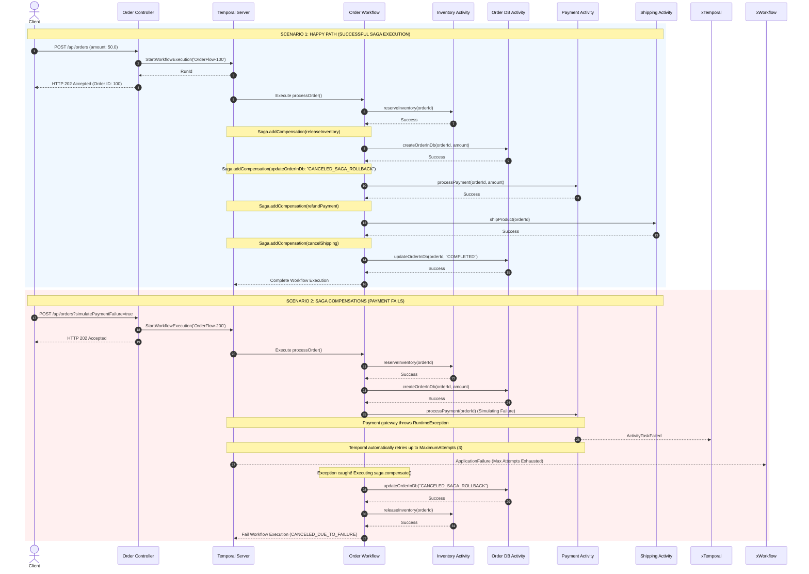

# Temporal SAGA Sequence Diagram

Below is a detailed sequence diagram showing the interactions between the REST API, Temporal, the Workflow Orchestrator, and the Activity Workers. It covers both the standard expected execution (Happy Path) and the compensating rollback flow (Failure Path).

